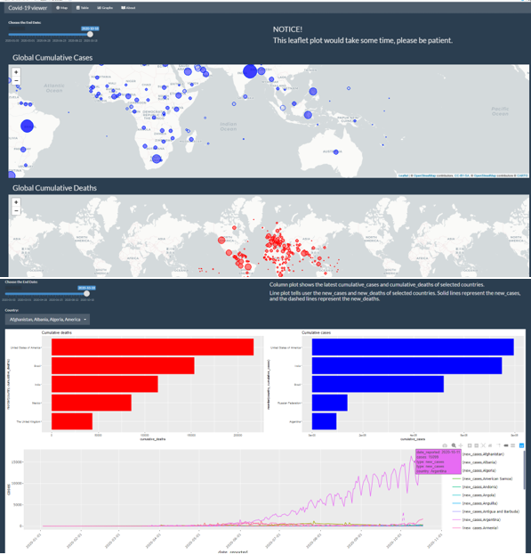

```{r setup, include=FALSE}
knitr::opts_chunk$set(collapse = TRUE)
```

## Overview `r emo::ji("movie_camera")`

In this blog post, I will be reviewing an R package (How fun is that?), this package named `covid19ViewerShiny` is authored by [**Yuheng Cui**](https://github.com/ycui0008), containing different functions, a dataset and a shiny application which depicts the [COVID19](https://covid19.who.int/) pandemic which is currently running rampant throughout the world.

The development version of the package can be found in [GITHUB](https://github.com/etc5523-2020/r-package-assessment-ycui0008).

The main goal of covid19ViewerShiny package is to a compact and consolidated way for users to visualize and understand the baneful effects of the pandemic. This package has a shiny dashboard that visualizes the condition of the pandemic in all countries of the world. It contains three functions:

- `launch_app()` : This function helps the user launch the shiny dashboard for user interaction and more.

- `multiSelection()` : This function helps the user to create a drop list in the shiny application, which contains country names that the user wishes to view the condition of. This is a function which is for creating the user interaction with the app.

- `colPlot()` : This function is provided to create a column plot within the shiny app which visualizes the cumulative_cases and cumulative deaths of top 5 countries in each category.This function is for removing redundancy within the codes for creation of the plots.

## What I think about the package? `r emo::ji("thought_balloon")`

From the name, the README file and the pkgdown web page, it was quite clear what this package does, I expected this package to produce a shiny application with just one function, which shows the pandemic rise and the deaths associated within each country, a dataset and also three functions. 

And I would say that the package delivered what was spoken of within the documentations and the name. The launch_app() is the main function for this app, it was easy for me to successfully run the function to get a shiny app without any extra work from my end. The files and folders are structured and I could find my way around them with ease.

The shiny app as spoken in the article by the author: [`covid19 app`](https://etc5523-2020.github.io/r-package-assessment-ycui0008/articles/covid19ViewerShiny.html),contains four tabs within the app.I really like the layout of app, it is not too much information and cramped up. Just enough information for user's understanding.

The application provides a slider input for the dates reflecting the cases based on the user's input, a line graph which shows the cases within the countries chosen by the user. 

## Improvements on the package, shiny app or the documetation? `r emo::ji("memo")`

I would like to start off by saying the package itself as a whole is structured , accomplishes what is expected of it without any errors. Although I did notice that the test for server function `colPlot()` was not done, tests are very important when making a package, it gives a clear understanding to the developer whether the functions made are effective and working well for any type of input values. 

Coming to the shiny app, I really appreciate the efforts the author has taken to make this user effective, interactive app. One thing within the codes of the app is the use of HTML tag `<p>`, I would like to add that the author does not have to write <p> tag for every line, as the <p> tag does tell us it is a paragraph. 

Lastly, the documentation, I was able to navigate myself through this R package thanks to the documentation made. There were three points that I would like to convey:

- I found it to be very difficult for understanding how to give the arguments for the function, `colPlot()`, the function failed for me outside the app and I did try to find out different ways I could use it but in vain , would really appreciate it if that was given more clearly.

- After running the command `renv::dependencies()` in the project, I found that a couple of R package were not mentioned in the DESCRIPTION file Suggests/Imports sections like janitor,usethis,tidyverse and pkgdown. *I would recommend using `renv::depenedencies` on the future packages to know which are the packages you can/should include.*

- Lastly, the documentation for the shiny app, as not all people who look at the visualizations can take away what the author is trying to convey, maybe a summary of each plot, if the page is completely filled , you could try using `tabset` for a better understanding of what is.

## Takeaways `r emo::ji("open_book")`

Other than being amazed by the amount of work put into the package, it is always a learning step when looking into the codes and ideas of other people. Easier way of implementing any code you thought otherwise, so it is always a pleasure to look at the codes which create such fantastic plots(the train of thought, **All Aboard!**). 

Checklist:

### Package review

- [ $\checkmark$ ] **Installation instructions:** for the package is found in README
- [ $\checkmark$ ] **Vignette(s)** demonstrating major functionality that runs successfully locally
- [ $\checkmark$ ] **Function Documentation:** for all exported functions in R help
- [ $\checkmark$ ] **Examples** for all exported functions in R Help that run successfully locally
#### Functionality
- [$\checkmark$  ] **Installation:** Installation succeeds as documented.
- [ $\checkmark$ ] **Functionality:** Any functional claims of the software been confirmed.
- [ ] **Automated tests:** Unit tests cover essential functions of the package
and a reasonable range of inputs and conditions. All tests pass on the local machine.


A Glimpse of the dashboard



### References

  Hadley Wickham, Romain François and Lucy D'Agostino McGowan (2020). emo: Easily Insert 'Emoji'. R package version 0.0.0.9000.
  https://github.com/hadley/emo


